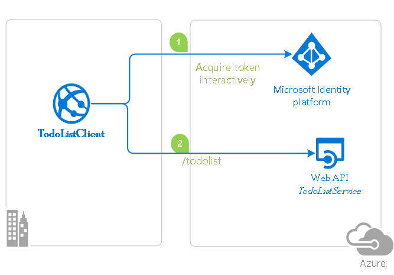

# An Angular single-page application that authenticates users with Azure AD and calls a protected ASP.NET Core Web API

## About this sample

### Overview

This sample demonstrates a cross-platform application suite involving an Angular SPA (*TodoListSPA*) calling an ASP.NET Core Web API (*TodoListAPI*) secured with Azure Active Directory.

### Scenario

- TodoListSPA uses [MSAL.js](https://github.com/AzureAD/microsoft-authentication-library-for-js) and [MSAL-Angular](https://github.com/AzureAD/microsoft-authentication-library-for-js/tree/dev/lib/msal-angular) to authenticate a user.
- The app then obtains an [access token](https://docs.microsoft.com/azure/active-directory/develop/access-tokens) from Azure Active Directory (Azure AD) on behalf of the authenticated user.
- The access token is then used to authorize the call to the TodoListAPI.
- TodoListAPI uses [MSAL.NET](https://github.com/AzureAD/microsoft-authentication-library-for-dotnet) and [Microsoft.Identity.Web](https://github.com/AzureAD/microsoft-identity-web) to protect its endpoint and accept authorized calls.



> [!NOTE]
> This sample uses Angular 9 with .NET Core 3.1 and is configured to support sign-in with **personal Microsoft accounts**.

### Contents

| File/folder       | Description                                |
|-------------------|--------------------------------------------|
| `AppCreationScripts` | Contains Powershell scripts to automate app registrations. |
| `ReadmeFiles`     | Sample readme files.                       |
| `TodoListAPI`     | Source code of the TodoList API.           |
| `TodoListSPA`     | Source code of the TodoList client SPA.    |
| `CHANGELOG.md`    | List of changes to the sample.             |
| `CONTRIBUTING.md` | Guidelines for contributing to the sample. |
| `README.md`       | This README file.                          |
| `LICENSE`         | The license for the sample.                |

## Setup

### Prerequisites

- [Node.js](https://nodejs.org/en/download/) must be installed to run this sample.
- [Angular-cli](https://cli.angular.io/) must be installed to run this sample.
- [Dotnet Core SDK](https://dotnet.microsoft.com/download) must be installed to run this sample.
- We recommend [VS Code](https://code.visualstudio.com/download) for running and debugging this cross-platform application.
- An Azure Active Directory (Azure AD) tenant. For more information on how to get an Azure AD tenant, see [How to get an Azure AD tenant](https://azure.microsoft.com/documentation/articles/active-directory-howto-tenant/).

### Steps

Using a command line interface such as VS Code integrated terminal, follow the steps below:

#### Step 1. Clone or download this repository

```console
git clone https://github.com/Azure-Samples/ms-identity-javascript-angular-spa-aspnetcore-webapi.git
```

> [!NOTE]
> Given that the name of the sample is quite long, and so are the names of the referenced NuGet packages, you might want to clone it in a folder close to the root of your hard drive, to avoid file size limitations on Windows.

#### Step 2. Install .NET Core API dependencies

```console
cd TodoListAPI
dotnet restore
```

#### Step 3. Trust development certificates

```console
dotnet dev-certs https --clean
dotnet dev-certs https --trust
```

Learn more about [HTTPS in .NET Core](https://docs.microsoft.com/aspnet/core/security/enforcing-ssl).

#### Step 4. Install Angular SPA dependencies

```console
cd ../
cd TodoListSPA
npm install
```

### Register the sample applications with your Azure Active Directory tenant

There are two projects in this sample. Each needs to be separately registered in your Azure AD tenant. To register these projects, you can:

- either follow the steps below for manual registration,
- or use PowerShell scripts that:
  - **automatically** creates the Azure AD applications and related objects (passwords, permissions, dependencies) for you.
  - modify the configuration files.

<details>
  <summary>Expand this section if you want to use this automation:</summary>

1. On Windows, run PowerShell and navigate to the root of the cloned directory
1. In PowerShell run:

   ```PowerShell
   Set-ExecutionPolicy -ExecutionPolicy RemoteSigned -Scope Process -Force
   ```

1. Run the script to create your Azure AD application and configure the code of the sample application accordingly.
1. In PowerShell run:

   ```PowerShell
   cd .\AppCreationScripts\
   .\Configure.ps1
   ```

   > Other ways of running the scripts are described in [App Creation Scripts](./AppCreationScripts/AppCreationScripts.md)
   > The scripts also provide a guide to automated application registration, configuration and removal which can help in your CI/CD scenarios.

1. Follow the section on "Running the sample" below.

</details>

#### Register the service app (TodoListAPI)

> [!NOTE]
> This sample is **not** configured to be a multi-tenant sample (learn more about [tenancy in Azure AD](https://docs.microsoft.com/azure/active-directory/develop/single-and-multi-tenant-apps)). If you would like to authorize users from other tenants to use this application, you may want to review [this tutorial](https://github.com/Azure-Samples/ms-identity-javascript-angular-spa-aspnet-webapi-multitenant) first.

1. Navigate to the Microsoft identity platform for developers [App registrations](https://go.microsoft.com/fwlink/?linkid=2083908) page.
1. Select **New registration**.
1. In the **Register an application page** that appears, enter your application's registration information:
   - In the **Name** section, enter a meaningful application name that will be displayed to users of the app, for example `TodoListAPI`.
   - Under **Supported account types**, select **Accounts in any organizational directory and personal Microsoft accounts**.
1. Select **Register** to create the application.
1. In the app's registration screen, find and note the **Application (client) ID**. You use this value in your app's configuration file(s) later in your code.
1. Select **Save** to save your changes.
1. In the app's registration screen, click on the **Expose an API** blade to the left to open the page where you can declare the parameters to expose this app as an Api for which client applications can obtain [access tokens](https://docs.microsoft.com/azure/active-directory/develop/access-tokens) for.
The first thing that we need to do is to declare the unique [resource](https://docs.microsoft.com/azure/active-directory/develop/v2-oauth2-auth-code-flow) URI that the clients will be using to obtain access tokens for this Api. To declare an resource URI, follow the following steps:
   - Click `Set` next to the **Application ID URI** to generate a URI that is unique for this app.
   - For this sample, accept the proposed Application ID URI (api://{clientId}) by selecting **Save**.
1. All Apis have to publish a minimum of one [scope](https://docs.microsoft.com/azure/active-directory/develop/v2-oauth2-auth-code-flow#request-an-authorization-code) for the client's to obtain an access token successfully. To publish a scope, follow the following steps:
   - Select **Add a scope** button open the **Add a scope** screen and Enter the values as indicated below:
        - For **Scope name**, use `access_as_user`.
        - Select **Admins and users** options for **Who can consent?**
        - For **Admin consent display name** type `Access TodoListAPI`
        - For **Admin consent description** type `Allows the app to access TodoListAPI as the signed-in user.`
        - For **User consent display name** type `Access TodoListAPI`
        - For **User consent description** type `Allow the application to access TodoListAPI on your behalf.`
        - Keep **State** as **Enabled**
        - Click on the **Add scope** button on the bottom to save this scope.

##### Configure the  service app (TodoListAPI) to use your app registration

Open the project in your IDE to configure the code.
>In the steps below, "ClientID" is the same as "Application ID" or "AppId".

1. Open the `TodoListAPI\appsettings.json` file
1. Find the app key `Domain` and replace the existing value with your Azure AD tenant name.
1. Find the app key `ClientId` and replace the existing value with the application ID (clientId) of the `TodoListAPI` application copied from the Azure portal.

#### Register the client app (TodoListSPA)

1. Navigate to the Microsoft identity platform for developers [App registrations](https://go.microsoft.com/fwlink/?linkid=2083908) page.
1. Select **New registration**.
1. In the **Register an application page** that appears, enter your application's registration information:
   - In the **Name** section, enter a meaningful application name that will be displayed to users of the app, for example `TodoListSPA`.
   - Under **Supported account types**, select **Accounts in any organizational directory and personal Microsoft accounts**.
   - In the **Redirect URI (optional)** section, select **Single-page application** in the combo-box and enter the following redirect URI: `http://localhost:4200/`.
1. Select **Register** to create the application.
1. In the app's registration screen, find and note the **Application (client) ID**. You use this value in your app's configuration file(s) later in your code.
1. In the app's registration screen, select **Authentication** in the menu.
   - If you don't have a platform added, select **Add a platform** and select the **Web** option.
   - In the **Implicit grant** section, check the **Access tokens** and **ID tokens** option as this sample requires
     the [Implicit grant flow](https://docs.microsoft.com/azure/active-directory/develop/v2-oauth2-implicit-grant-flow) to be enabled to
     sign-in the user, and call an API.

1. Select **Save** to save your changes.
1. In the app's registration screen, click on the **API permissions** blade in the left to open the page where we add access to the Apis that your application needs.
   - Click the **Add a permission** button and then,
   - Ensure that the **My APIs** tab is selected.
   - In the list of APIs, select the API `TodoListAPI`.
   - In the **Delegated permissions** section, select the **access_as_user** in the list. Use the search box if necessary.
   - Click on the **Add permissions** button at the bottom.

##### Configure the  client app (TodoListSPA) to use your app registration

Open the project in your IDE to configure the code.
>In the steps below, "ClientID" is the same as "Application ID" or "AppId".

1. Open the `TodoListSPA\src\app\app-config.json` file
1. Find the app key `clientId` and replace the existing value with the application ID (clientId) of the `TodoListSPA` application copied from the Azure portal.
1. Find the app key `redirectUri` and replace the existing value with the base address of the TodoListSPA project (by default `http://localhost:4200/`).
1. Find the app key `postLogoutRedirectUri` and replace the existing value with the base address of the TodoListSPA project (by default `http://localhost:4200/`).
1. Find the app key `resourceUri` and replace the existing value with the base address of the TodoListAPI project (by default `https://localhost:44351/api/todolist/`).
1. Find the app key `resourceScope` and replace the existing value with *Scope* you created earlier `api://{clientId}/access_as_user`.

### Run the sample

Using a command line interface such as VS Code integrated terminal, locate the application directory. Then:  

```console
cd ../
cd TodoListSPA
npm start
```

In a separate console window, execute the following commands

```console
cd TodoListAPI
dotnet run
```

### Explore the sample

1. Open your browser on http://localhost:4200.
2. Sign-in using the button on top-right.
3. Click on the "Get my tasks" button to access your todo list.

> [!NOTE]
> Did the sample not work for you as expected? Did you encounter issues trying this sample? Then please reach out to us using the [GitHub Issues](../issues) page.

## Debugging the sample

To debug the .NET Core Web API that comes with this sample, install the [C# extension](https://marketplace.visualstudio.com/items?itemName=ms-dotnettools.csharp) for Visual Studio Code.

Learn more about using [.NET Core with Visual Studio Code](https://docs.microsoft.com/dotnet/core/tutorials/with-visual-studio-code).

## Key concepts

This sample demonstrates the following AAD and MSAL workflows:

- How to protect a Web API.
- How to configure application parameters.
- How to sign-in.
- How to sign-out.
- How to acquire an access token.
- How to make an API call with the access token.

## More information

For more information, visit the following links:

- Articles about the Microsoft identity platform are at [http://aka.ms/aaddevv2](http://aka.ms/aaddevv2), with a focus on:
  - [The OAuth 2.0 Implicit Grant in Azure AD](https://docs.microsoft.com/azure/active-directory/develop/v2-oauth2-implicit-grant-flow)
  - [The OpenID Connect protocol](https://docs.microsoft.com/azure/active-directory/develop/v2-protocols-oidc)
  - [Azure AD OAuth Bearer protocol](https://docs.microsoft.com/azure/active-directory/develop/active-directory-v2-protocols)
  - [Access token](https://docs.microsoft.com/azure/active-directory/develop/access-tokens)
  - [Secure a Web API with Azure AD](https://docs.microsoft.com/azure/active-directory/develop/scenario-protected-web-api-overview)

- To lean more about the application registration, visit:
  - [Quickstart: Register an application with the Microsoft identity platform (Preview)](https://docs.microsoft.com/azure/active-directory/develop/quickstart-register-app)
  - [Quickstart: Configure a client application to access web APIs (Preview)](https://docs.microsoft.com/azure/active-directory/develop/quickstart-configure-app-access-web-apis)
  - [Quickstart: Configure an application to expose web APIs (Preview)](https://docs.microsoft.com/azure/active-directory/develop/quickstart-configure-app-expose-web-apis)

## Community Help and Support

Use [Stack Overflow](http://stackoverflow.com/questions/tagged/msal) to get support from the community.
Ask your questions on Stack Overflow first and browse existing issues to see if someone has asked your question before.
Make sure that your questions or comments are tagged with [`msal` `dotnet` `angular` `azure-active-directory`].

If you find a bug in the sample, please raise the issue on [GitHub Issues](../../issues).

To provide a recommendation, visit the following [User Voice page](https://feedback.azure.com/forums/169401-azure-active-directory).

## Contributing

This project welcomes contributions and suggestions.  Most contributions require you to agree to a
Contributor License Agreement (CLA) declaring that you have the right to, and actually do, grant us
the rights to use your contribution. For details, visit https://cla.opensource.microsoft.com.

When you submit a pull request, a CLA bot will automatically determine whether you need to provide
a CLA and decorate the PR appropriately (e.g., status check, comment). Simply follow the instructions
provided by the bot. You will only need to do this once across all repos using our CLA.

This project has adopted the [Microsoft Open Source Code of Conduct](https://opensource.microsoft.com/codeofconduct/).
For more information see the [Code of Conduct FAQ](https://opensource.microsoft.com/codeofconduct/faq/) or
contact [opencode@microsoft.com](mailto:opencode@microsoft.com) with any additional questions or comments.
